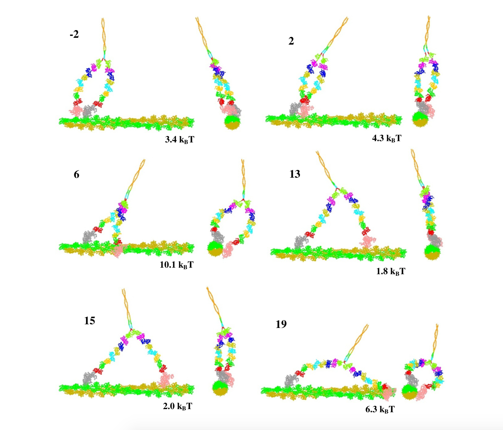
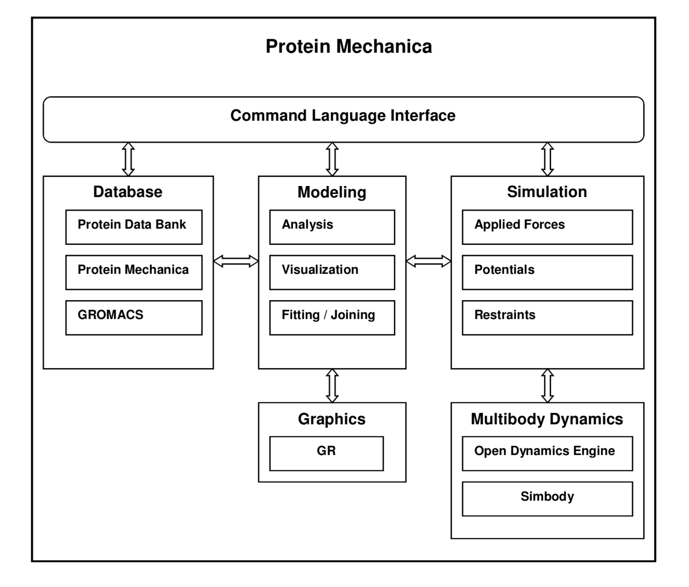
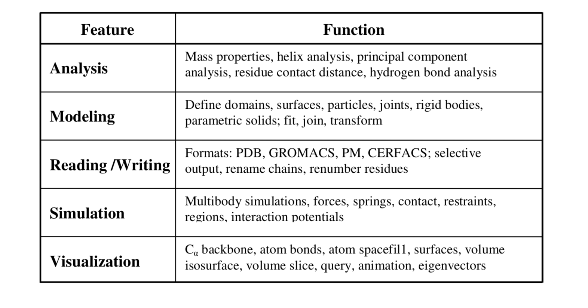
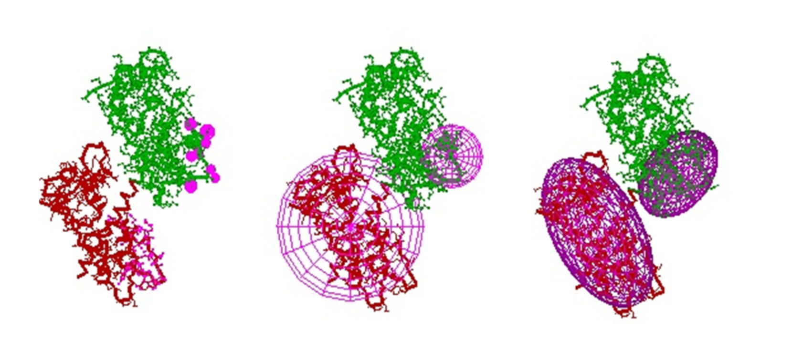

# ProteinMechanica
This Protein Mechanica is an interactive application that allows users to generate structurally realistic models of molecular motor conformations. Coarse-grained models of molecular structures are constructed by combining groups of atoms into a system of arbitrarily shaped rigid bodies connected by joints. Contacts between rigid bodies enforce excluded volume constraints, and spring potentials model system elasticity. This simplified representation allows the conformations of complex molecular motors to be simulated interactively, providing a tool for hypothesis building and quantitative comparisons between models and experiments.

Protein Mechanica provides an interactive environment executing on a personal computer that allows models of molecular motors to be built, visualized, and simulated without significant computational resources or substantial computer expertise. A command language allows research scientists in structural biology, biochemistry, and biophysics with no programming experience to access the functionality of the software.

*Conformations of an 8IQ neck myosin V dimer spanning different numbers of actin binding sites.*

# Architecture
Protein Mechanica is composed of six major components: Command Language Interface, Database, Modeling, Simulation, Graphics and Multibody Dynamics. The graphics and multibody dynamics components provide generic interfaces to graphics and dynamics engine applications.

*Protein Mechanica architecture.*

Protein Mechanica is implemented as three software components: 1) C++ library providing the core functionality to create, simulate and visualize molecular structures 2) C++ GR library providing interactive graphics and 3) an interactive graphics application providing a command language interface to the functionality of Protein Mechanica.

*Protein Mechanica features and functions.*

# Structural Geometry
To create models of molecular structures at atomic resolution, Protein Mechanica reads files from the Protein Data Bank (PDB) that describe the atomic coordinates, atom types and amino acid residues for a molecule structure obtained from X-ray crystallographic or NMR experiments.

The fundamental structural unit in Protein Mechanica is the *domain*, which we define generally in this context to mean a user-specified set of amino acid residues selected from one or more polypeptide chains. Domains are the basis for substructuring a molecule for coarse-graining.

*Domain definition and molecular representations.*

# Simulating Coarse-Grainded Models
Simulations of coarse-grained models in Protein Mechanica are performed using multibody methods. These methods numerically solve the equations of motion used to describe the dynamic behavior of a system of rigid bodies connected by joints.

## Rigid Bodies
Coarse-grained mechanical models are derived by mapping molecular domains, surfaces and parametric solids into rigid bodies. The mass, center of mass and moments of inertia are computed based on the geometric model. Mass properties are computed for each molecular domain using the mass and coordinates of its atoms. For a surface bounding a solid, inertial properties are computed using a given density and equating the surface integrals over its closed polygon mesh with volume integrals using Gauss's Theorem.

## Joints
The relative displacements and rotations between two rigid bodies are constrained by a joint. A joint is located at a common point (called an anchor point) within the bodies it connects and is constrained to remain fixed in each body as the bodies move. For molecular domains a joint can be positioned at a common Cα backbone atom to ensure continuity between the domains as they move during a simulation.

The data needed to define a joint’s location and axes for molecular structures is specified using the chain identifiers, residue numbering and atom names read in from atomic coordinate files.

## Modeling Physical Interactions
Protein Mechanica models several types of physical interactions: excluded volume, elasticity and electrostatics. The interactions that model these properties can be defined for molecular domains at multiple resolutions, from a detailed atomic level to simple geometric representations, such as spheres or ellipsoids. Interactions between domains must be explicitly defined and may be restricted to specified regions (e.g. amino acid subsets) within each domain. This approach increases computational efficiency and provides the flexibility to define interactions where they are needed.

Interactions can be defined between rigid bodies derived from molecular domains, surfaces, particles and parametric solids. For example, a molecular domain can interact with a surface or particles obtained from a cryo-electron microscopy density map. This provides a general mechanism to model the interaction of a molecular system with lower-resolution data or even structural geometry from engineering nanodevices.

*Contact geometry. Two rigid domains (colored red and green) are shown using Cα backbone and atom-bonds representations. (A) Contact defined for each atom in a region of the lower domain are shown as purple spheres and defined for each side chain in a region for the upper domain. (B) Sphere geometries defined for the entire lower domain and a small region of the upper domain are shown as purple spheres. (C) Ellipsoid geometries defined for the entire lower domain and a smaller region of the upper domain shown in purple provide a closer fit to domain geometry.*

# References
Parker D, Bryant Z, Delp SL. Coarse-Grained Structural Modeling of Molecular Motors Using Multibody Dynamics. Cell Mol Bioeng. 2009;2(3):366‐374. 

Parker D, Coarse-grained Structural Modeling of Molecular Motors, Stanford University, 2011

Chen L, Nakamura M, Schindler TD, Parker D, Bryant Z. Engineering controllable bidirectional molecular motors based on myosin. Nat Nanotechnol. 2012;7(4):252‐256.

