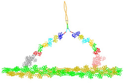

# ProteinMechanica
This Protein Mechanica is an interactive application that allows users to generate structurally realistic models of molecular motor conformations. Coarse-grained models of molecular structures are constructed by combining groups of atoms into a system of arbitrarily shaped rigid bodies connected by joints. Contacts between rigid bodies enforce excluded volume constraints, and spring potentials model system elasticity. This simplified representation allows the conformations of complex molecular motors to be simulated interactively, providing a tool for hypothesis building and quantitative comparisons between models and experiments.

*Simulation of a myosin V dimer binding to actin.*
