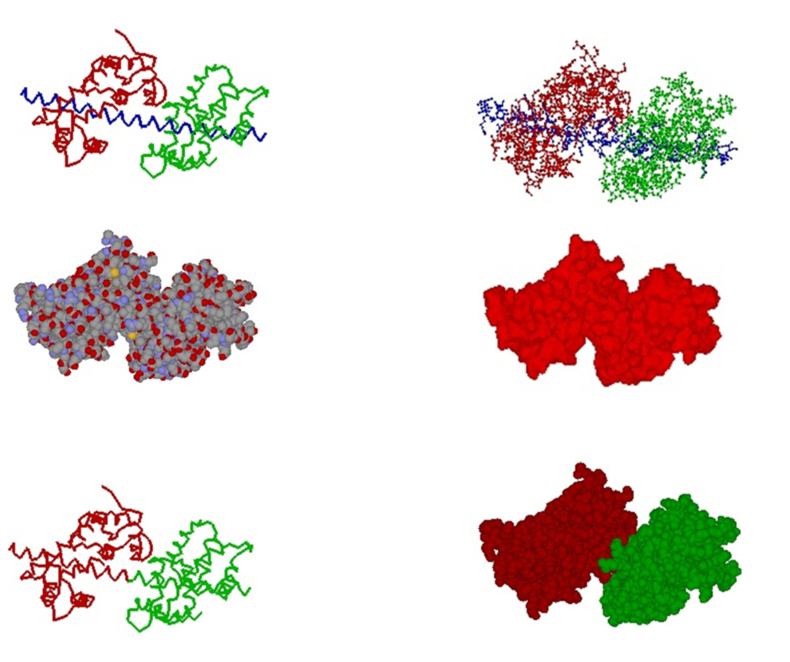

# ProteinMechanica
This Protein Mechanica is an interactive application that allows users to generate structurally realistic models of molecular motor conformations. Coarse-grained models of molecular structures are constructed by combining groups of atoms into a system of arbitrarily shaped rigid bodies connected by joints. Contacts between rigid bodies enforce excluded volume constraints, and spring potentials model system elasticity. This simplified representation allows the conformations of complex molecular motors to be simulated interactively, providing a tool for hypothesis building and quantitative comparisons between models and experiments.

Protein Mechanica provides an interactive environment executing on a personal computer that allows models of molecular motors to be built, visualized, and simulated without significant computational resources or substantial computer expertise. A command language allows research scientists in structural biology, biochemistry, and biophysics with no programming experience to access the functionality of the software.

*Simulation of a myosin V dimer binding to actin.*

# Architecture
Protein Mechanica is composed of six major components: Command Language Interface, Database, Modeling, Simulation, Graphics and Multibody Dynamics. The graphics and multibody dynamics components provide generic interfaces to graphics and dynamics engine applications.

*Protein Mechanica architecture.*

Protein Mechanica is implemented as three software components: 1) C++ library providing the core functionality to create, simulate and visualize molecular structures 2) C++ GR library providing interactive graphics and 3) an interactive graphics application providing a command language interface to the functionality of Protein Mechanica.

*Protein Mechanica features and functions.*

# Structural Geometry
To create models of molecular structures at atomic resolution, Protein Mechanica reads files from the Protein Data Bank (PDB) that describe the atomic coordinates, atom types and amino acid residues for a molecule structure obtained from X-ray crystallographic or NMR experiments.

The fundamental structural unit in Protein Mechanica is the *domain*, which we define generally in this context to mean a user-specified set of amino acid residues selected from one or more polypeptide chains. Domains are the basis for substructuring a molecule for coarse-graining.

# References
Parker D, Bryant Z, Delp SL. Coarse-Grained Structural Modeling of Molecular Motors Using Multibody Dynamics. Cell Mol Bioeng. 2009;2(3):366‐374. 

Parker D, Coarse-grained Structural Modeling of Molecular Motors, Stanford University, 2011

Chen L, Nakamura M, Schindler TD, Parker D, Bryant Z. Engineering controllable bidirectional molecular motors based on myosin. Nat Nanotechnol. 2012;7(4):252‐256.

